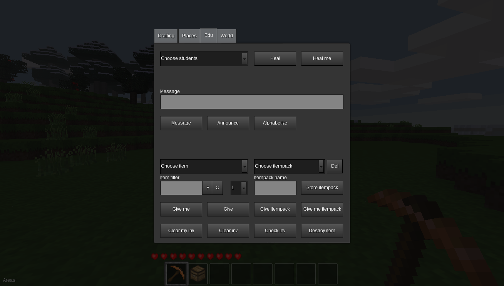
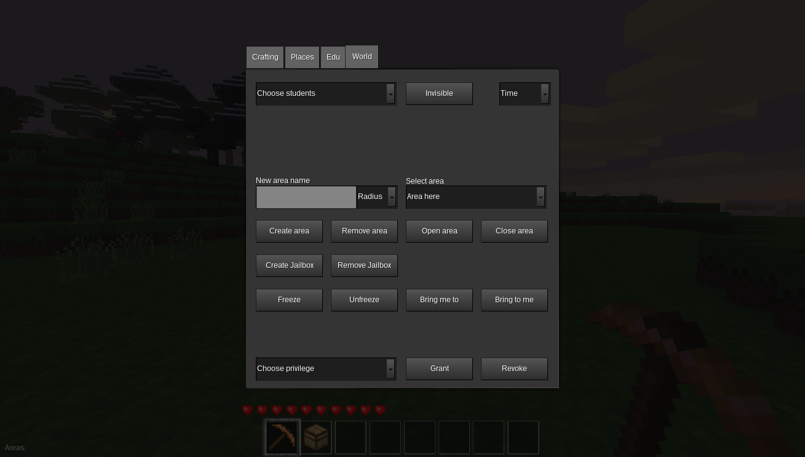

# minetest-edutest-ui
This mod provides user interface extensions for the MinetestEDU/EDUtest project. It depends on [my fork](https://github.com/apienk/edutest-chatcommands) of `edutest-chatcommands` mod by Isidor Zeuner.

The goal of the MinetestEDU or EDUtest project is to make Minetest easy to use by a teacher in a classroom environment. The original idea was described in [this Minetest forum thread](https://forum.minetest.net/viewtopic.php?f=5&t=11452). The project is a collection of mods (a modpack) that allows teachers to feel in control of the students while in game. The following features are provided by the GUI (Note: Buttons will only show up if optionally `their respective mods` are loaded)(Note: The formspec tabs will only show up if player has `instructor` privilege):

Components
----------
- student selector
- item selector with filtering
- itempack selector
- privilege selector
- area selector `areas`
- time selector

Inventory functions
-------------------
- give items to all students, a student or oneself
- give itempacks (collections of items) to all students, a student or oneself
- define a new itempack from current inventory
- delete a stored itempack
- clear inventory of all students, a student or oneself `invmanagement`
- check inventory of a student
- destroy a wielded item

Messaging functions
-------------------
- message all students or a student using on-screen chat (top of screen, unintrusive)
- message all students or a student using a custom dialog (center of screen, stops interaction)
- give oneself a complete set of letter/number blocks needed to build a message in the world `teaching`

World functions
---------------
- create/remove a protected area (where only the owner can build or dig) for a student or oneself `areas`
- open/close an existing protected area for building and digging by non-owners `areas`
- erect/remove an impenetrable and indestructible barrier box (jailbox) around an area to keep students from wandering too far `jailbox`
- teleport oneself to a student, teleport all students or a student to oneself
- set in-game time (dawn, noon, dusk, midnight)

Other functions
---------------
- heal all students, a student or oneself
- freeze/unfreeze all students or a student (also mutes him or her in chat) `freeze`
- grant/revoke privileges to/from all students, a student or oneself (Note: if you need an assistant teacher grant him/her 'all' privileges)
- turn oneself invisible `invisible`

# To do
- ask questions in formspec and aggregate answers
- student groups
- written assignments
- internationalization
- reward system
- controlled PvP

# Other useful mods to use in classroom
- my fork of `teaching` mod: https://github.com/apienk/minetest-teaching (with hires letters and other features)
- my fork of `wardrobe` mod: https://github.com/apienk/minetest-mod-wardrobe (with nice GUI)
- my `jailbox` mod: https://github.com/apienk/minetest-jailbox

# Some lesson ideas

Mathematics:
- build a city of buildings and ask students to calculate total blocks per building
- make students build a multiplication table (pyramid) from blocks
- give resources and make students estimate or calculate the number of goods that can be crafted from them (division with remainder)
- set up math problems from `teaching` blocks and make students compete by trying to find and solve; reward them with diamonds or alike
- calculate height of buildings using Tales equation

Science:
- build a representation of the Solar System using real size and distance proportions (`worldedit` mod might be handy)
- experiment with conservation of energy by building a rollercoaster (requires `carts` mod)
- model an atom
- put students in an environment with very limited resources and discuss decisions that would lead to long-term survival
- renewable vs. non-renewable energy sources (requires `mesecons` or `technic` mod)

Languages:
- set up a contest where students or student groups compete by building words from letter blocks
- recreate and play a situation from a piece of literature or movie

